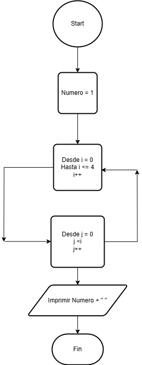

# Ejercicio 1 

Escribe un programa en Java que imprima el patrón siguiente:
1 

2 3 

4 5 6 

7 8 9 10 

### Diagrama de Flujo

### Pseudocódigo

Pasos:
- Inicio
- Numero = 1
- Bucle i desde 0 hasta 4 incrementando +1
- j desde 0 hasta j>i, incrementando +1
- Imprimir "Numero + " " "
- Fin

