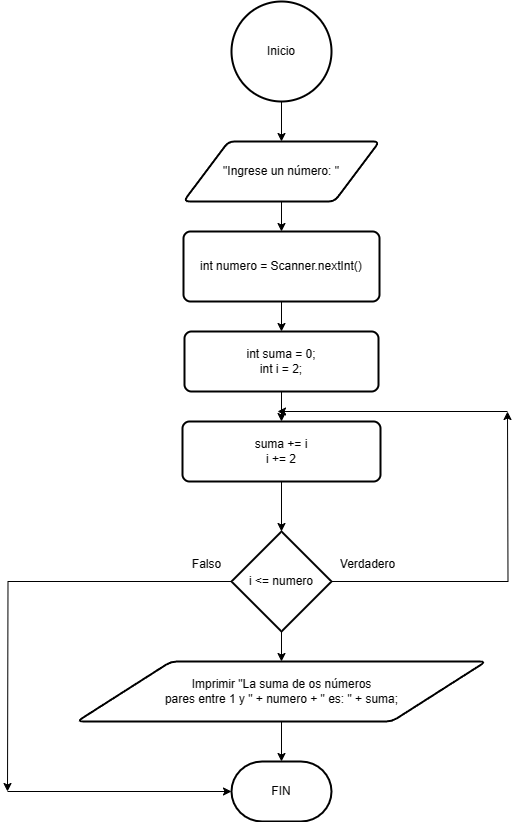

# Ejercicio 10 

Calcular la suma de todos los números pares entre 1 y un número ingresado por el usuario utilizando un bucle do-while.

### Diagrama de Flujo

### Pseudocódigo

Pasos:
- Inicio
- Crear objeto Scanner. Solicitamos al usuario que escriba por consola "Ingrese un número: " 
- Leer el número ingresado por el usuario
- Inicializar variables de suma y 'i'
- Iniciar bucle do-while
- Mostrar resultado de la suma
- Fin

