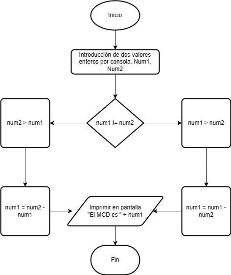

# Ejercicio 2 

Escribe un programa en Java que encuentre el máximo común divisor (MCD) de dos números. Se debe solicitar los números por teclado.

### Diagrama de Flujo

### Pseudocódigo

Pasos:
- Inicio
- Establecemos num1 y num2
- Input por consola para el num1
- Input por consola para el num2
- Leer los dos valores
- Asignarlos a las variables num1 y num2
- Mientras num1 != a num2
- Si num1 > num2 entonces __num1__ = num1-num2
- De lo contrario si num2 > num1 entonces __num1__ = num2 - num1
- Imprimimos por pantalla "El MCD es " + __num1__ lo cual mostrará el resultado en función de lo que haya introducido el usuario
- Fin

