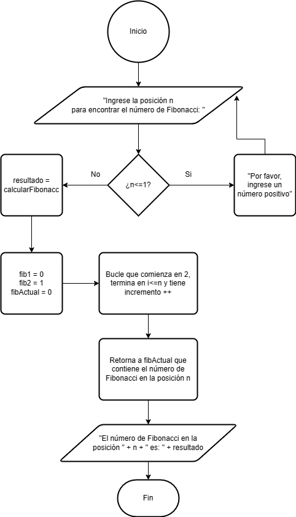

# Ejercicio 3 

Escribe un programa en Java que encuentre el número de Fibonacci en la posición n.  Se debe solicitar el número por teclado.

### Diagrama de Flujo

### Pseudocódigo

Pasos:
- "Ingrese la posición n para encontrar el número de Fibonacci: "
- n = scanner.nextIn()
- Si n<0 println "por favor, ingrese un número positivo"
- De lo contrario, resultado =calcularFibonacci en la posición "n" es: + resultado
- Si n<=1 retornamos a n
- Por el contrario, si "n" es mayor que 1, inicializamos tres variables, fib1 en 0 y fib1 en 1, fibActual para almacenar el número de Fibonacci en la posición actual
- Luego, utilizamos un bucle for para iterar desde la posición 2 hasta la posición n. En cada iteración, calculamos fibActual como la suma de fib1 y fib2, y luego actualizamos fib1 y fib2 para que contengan los valores de las dos posiciones anteriores. for (int i = 2; i <= n; i++)
- Finalmente, retornamos fibActual, que contiene el número de Fibonacci en la posición n.
- Fin

