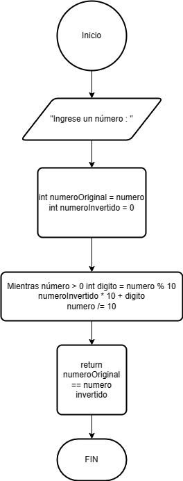

# Ejercicio 4 

Escribe un programa en Java que verifique si un número es palíndromo. Se debe solicitar el número por teclado.

### Diagrama de Flujo

### Pseudocódigo

Pasos:
- Inicio
- Solicitar número
- Leer número y almacenarlo en variable numero
- Iniciar variables "numeroOriginal" y "numeroInvertido" que se utilizarán más adelante para verificar si el número es un palíndromo
- Verificar palíndromo: Comienza un bucle mientras el número original no ssea igual a cero
- Obtener último dígito: Se obtiene el último dígito de número original utilizando el operador '%' 
- Invertir número: El último dígito se agrega al número invertido después de multiplicar el número invertido por 10
- Eliminar último dígito
- Verificar si el numeroOriginal es igual a cero. Si no es cero, el bucle continúa
- Comparar números. Una vez invertidos completamente el numeroOriginal, se compara con el número invertido para determinar si son iguales
- Si los números son iguales, el programa muestra el mensaje indicando que el número es palíndromo. Si no son iguales, muestra mensaje indicando que no lo es.
- Fin

