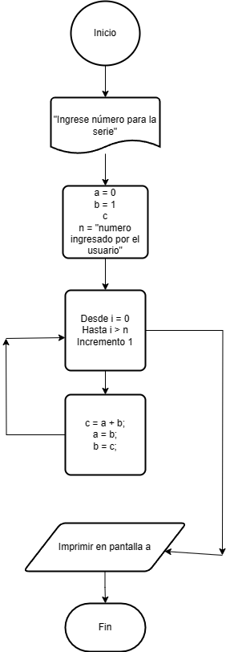

# Ejercicio 5 

Escribe un programa en Java que imprima los primeros n términos de la secuencia de Fibonacci. Se debe solicitar el número n por teclado.

### Diagrama de Flujo

### Pseudocódigo

Pasos:
- Inicio
- "Ingrese número para la serie"
- a = 0; b = 1; c; n = *numero que ingrese el usuario*
- Desde i = 0, hasta i > n con incremento +1
- C = a + b
- a = b
- b = c
- Imprimir en pantalla a
- Fin

