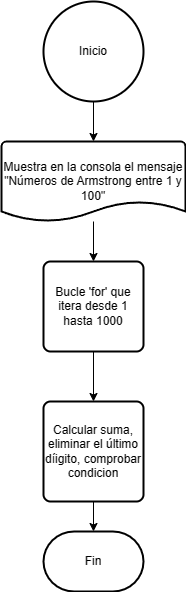

# Ejercicio 6 

Escribe un programa en Java que encuentre todos los números Armstrong entre 1 y 1000.

### Diagrama de Flujo

### Pseudocódigo

Pasos:
- Inicio
- "Números de Armstrong entre 1 y 1000"
- Bucle for: Inicia un bucle for que itera desde 1 hasta 1000.
- Si es un número de Armstrong: Si la función esNumeroArmstrong devuelve true, el número se muestra en la consola.
- Función esNumeroArmstrong: Esta función toma un número como entrada y verifica si es un número de Armstrong.
- Inicialización de variables: Inicializa variables para el número original, la suma de los dígitos y el valor de n (el número de dígitos del número original).
- Bucle while: Inicia un bucle while para procesar cada dígito del número.
- Obtener el último dígito: Extrae el último dígito del número actual.
- Calcular la suma: Eleva el último dígito a la potencia de n y lo suma a la variable suma.
- Eliminar el último dígito: Elimina el último dígito del número.
- Comprobar condición: Después de procesar todos los dígitos, verifica si la suma es igual al numeroOriginal. Si lo es, devuelve true, indicando que es un número de Armstrong; de lo contrario, devuelve false.
- Fin del bucle for: El bucle for finaliza cuando se han procesado todos los números del 1 al 1000.
- Fin

