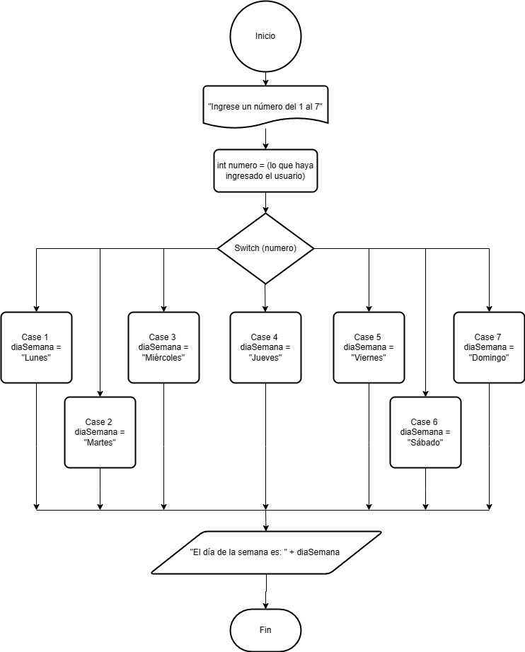

# Ejercicio 7 

Imprimir el nombre del día de la semana correspondiente a un número ingresado por el usuario utilizando una estructura switch.
El día a verificar se debe de pedir por teclado.

### Diagrama de Flujo

### Pseudocódigo

Pasos:
- Inicio
- Solicitar número del 1 al 7, para los casos del switch que será cada día de la semana. Esta estructura switch estará basada en el número ingresado.
- Caso 1. Si el número es igual a 1 se asigna el valor Lunes a la variable diaSemana. El programa sale del switch 
- Caso 2. Si el número es igual a 2 se asigna el valor Martes a la variable diaSemana. El programa sale del switch 
- Caso 3. Si el número es igual a 3 se asigna el valor Miércoles a la variable diaSemana. El programa sale del switch 
- Caso 4. Si el número es igual a 4 se asigna el valor Jueves a la variable diaSemana. El programa sale del switch 
- Caso 5. Si el número es igual a 5 se asigna el valor Viernes a la variable diaSemana. El programa sale del switch 
- Caso 6. Si el número es igual a 6 se asigna el valor Sábado a la variable diaSemana. El programa sale del switch
- Caso 7. Si el número es igual a 7 se asigna el valor Domingo a la variable diaSemana. El programa sale del switch
- Mostrar en pantalla "El día de la semana es: " + diaSemana
- Fin

