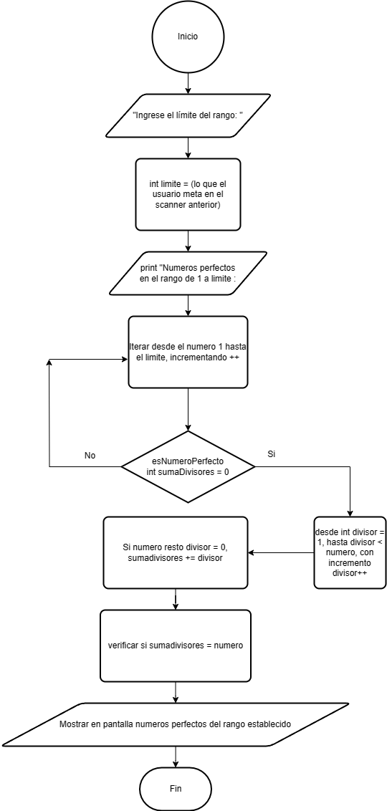

# Ejercicio 8 

Encontrar y mostrar todos los números perfectos en un rango dado utilizando un bucle for. Solicita el límite por teclado.

### Diagrama de Flujo

### Pseudocódigo

Pasos:
- Inicio
- Solicitar entrada por teclado para ingresar el limite
- Lee el numero ingresado y se almacena en la variable limite
- Se muestra mensaje en la consola indicando que se mostrarán los números perfectos en el rango de 1 a "limite"
- Bucle for que comienza en 1 y se ejecuta hasta el valor limite
- esNumeroPerfecto para verificar si el numero actual es un numero perfecto
- Si es un numero perfecto devuelve true y el numero se muestra en la consola
- sumadivisores = 0
- inicia bucle for que itera a través de los posibles divisores del número, desde 1 hasta el número excluyendo el número mismo
- Verificar si es divisor: En cada iteración dle bucle se verifica si el número es divisible por el divisor actual
- Sumar divisores: Si es divisor se suma el valor del divisor a "sumaDivisores"
- Comprobar condición: Después de completar el bucle se verifica si "sumaDivisores" es igual al número original
- Mostrar número perfecto: Si el número es perfecto según la función esNumeroPerfecto se meustra en la consola
- Fin bucle for
- Fin

