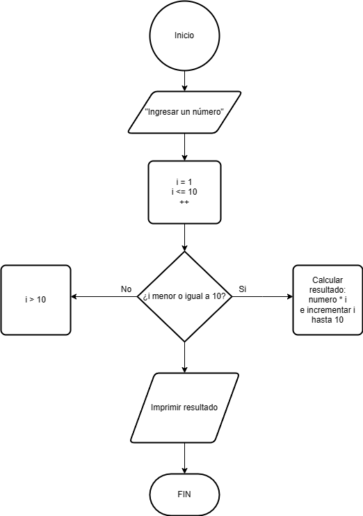

# Ejercicio 9 

Imprimir la tabla de multiplicar de un número ingresado por el usuario utilizando un bucle for. Solicita el valor de la tabla por teclado.

### Diagrama de Flujo

### Pseudocódigo

Pasos:
- Inicio
- Solicitar ingresar un número
- Leer el número ingresado por el usuario
- Iniciar un bucle for (i = 1; i <= 10) ¿i es menos o igual a 10? Sí: Calcular el resultado ( numero * i)
- Mostrar línea de la tabla de multiplicar (numero * i = resultado)
- Incrementar i > 10
- No: (i > 10)
- Finalizar bucle
- Fin

